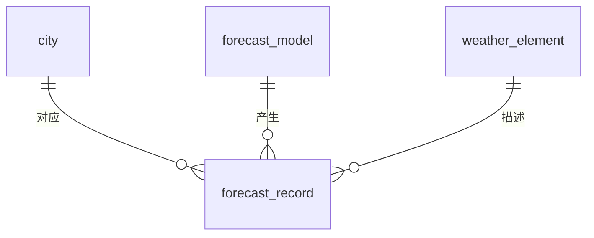

# ER 模型设计

## 1. 模型边界

ER 模型只包含城市 `city`、预报模型 `forecast_model`、气象要素 `weather_element` 和预报记录 `forecast_record` 四个实体。前三个是独立基础实体，`forecast_record` 是承接三条关联并保存有效时间与预报值的业务实体。本页只描述概念设计，不表示相关表或约束已在数据库中创建。

## 2. 实体与标识

| 实体 | 主键 | 候选标识或唯一标识 | 实体属性 |
| --- | --- | --- | --- |
| `city` | `id` | `city_code` | `id`, `city_code`, `city_name`, `longitude`, `latitude` |
| `forecast_model` | `id` | `model_code` | `id`, `model_code`, `model_name`, `description` |
| `weather_element` | `id` | `element_code` | `id`, `element_code`, `element_name`, `unit` |
| `forecast_record` | `id` | `(city_id, model_id, element_id, forecast_time)` | `id`, `city_id`, `model_id`, `element_id`, `forecast_time`, `value` |

`id` 是每个实体的代理主键。三个编码字段承担各自基础实体的稳定业务唯一标识；预报记录以四字段组合表达不可重复的业务事实。

## 3. 联系、基数与参与约束

| 一端实体 | 联系含义 | 多端实体 | 基数 | 参与约束 |
| --- | --- | --- | --- | --- |
| `city` | 城市拥有预报记录 | `forecast_record` | 1:N | 城市可暂时没有记录；每条记录必须关联一个城市。 |
| `forecast_model` | 模型生成预报记录 | `forecast_record` | 1:N | 模型可暂时没有记录；每条记录必须关联一个模型。 |
| `weather_element` | 要素描述预报记录 | `forecast_record` | 1:N | 要素可暂时没有记录；每条记录必须关联一个要素。 |

三个联系都由 `forecast_record` 中非空外键实现，不设置多对多联系。基础实体一旦被预报记录引用，删除操作受限制。

## 4. ER 表达

属性和唯一标识以本页“实体与标识”表为准；预报记录的完整组合唯一键固定为 `(city_id, model_id, element_id, forecast_time)`，其中任一字段都不单独唯一。

## 5. 从 ER 模型到关系模型

每个实体直接映射为一张关系表；三条 1:N 联系均把“一”端主键迁移到 `forecast_record`，分别形成 `city_id`、`model_id`、`element_id` 外键。基础实体的名称、编码、经纬度、说明和单位不迁移到预报记录，避免冗余和更新异常。

本页“ER 表达”小节给出完整 ER 图；关系映射结果及关系模型图见 [[03-数据库设计/03-逻辑结构设计|逻辑结构设计]]；项目入口见 [[00-项目总览/项目导航|项目导航]]。
