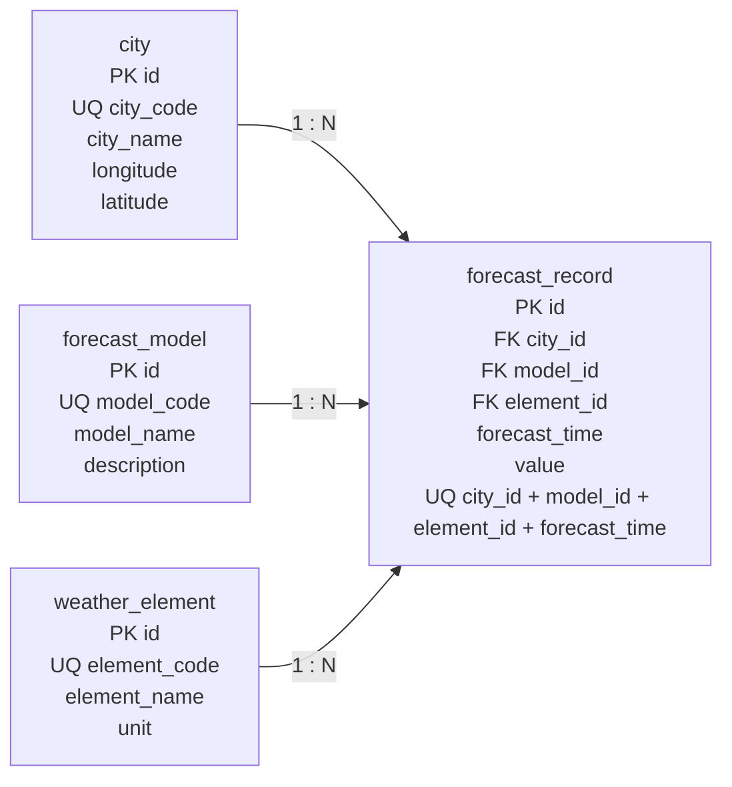

# 逻辑结构设计

## 1. 设计约定

关系模型面向 MySQL 8 技术栈；为保证经纬度 `CHECK` 约束由数据库实际执行，实施本设计的目标实例最低版本为 MySQL 8.0.16+。`PK` 表示主键，`FK` 表示外键，`UQ` 表示唯一约束；所有 `id` 均采用 `BIGINT UNSIGNED`，主键由 `AUTO_INCREMENT` 生成。除明确标为可空的 `forecast_model.description` 外，其余字段均不可空。下述内容是供下一阶段转换为 DDL 的设计基线，不代表 DDL 已执行。

## 2. 关系模式总览

- `city(id PK, city_code UQ, city_name, longitude, latitude)`
- `forecast_model(id PK, model_code UQ, model_name, description)`
- `weather_element(id PK, element_code UQ, element_name, unit)`
- `forecast_record(id PK, city_id FK, model_id FK, element_id FK, forecast_time, value, UQ(city_id, model_id, element_id, forecast_time))`

## 3. 表结构

### 3.1 城市表 `city`

| 字段 | 类型 | 可空 | 键或约束 |
| --- | --- | --- | --- |
| `id` | `BIGINT UNSIGNED` | 否 | `PRIMARY KEY`, `AUTO_INCREMENT` |
| `city_code` | `VARCHAR(32)` | 否 | `uq_city_city_code` 唯一 |
| `city_name` | `VARCHAR(50)` | 否 | 名称非空 |
| `longitude` | `DECIMAL(10,6)` | 否 | `-180 ≤ longitude ≤ 180` |
| `latitude` | `DECIMAL(10,6)` | 否 | `-90 ≤ latitude ≤ 90` |

### 3.2 预报模型表 `forecast_model`

| 字段 | 类型 | 可空 | 键或约束 |
| --- | --- | --- | --- |
| `id` | `BIGINT UNSIGNED` | 否 | `PRIMARY KEY`, `AUTO_INCREMENT` |
| `model_code` | `VARCHAR(32)` | 否 | `uq_forecast_model_model_code` 唯一 |
| `model_name` | `VARCHAR(50)` | 否 | 名称非空 |
| `description` | `VARCHAR(255)` | 是 | 默认 `NULL` |

### 3.3 气象要素表 `weather_element`

| 字段 | 类型 | 可空 | 键或约束 |
| --- | --- | --- | --- |
| `id` | `BIGINT UNSIGNED` | 否 | `PRIMARY KEY`, `AUTO_INCREMENT` |
| `element_code` | `VARCHAR(32)` | 否 | `uq_weather_element_element_code` 唯一 |
| `element_name` | `VARCHAR(50)` | 否 | 名称非空 |
| `unit` | `VARCHAR(16)` | 否 | 展示单位非空 |

### 3.4 预报记录表 `forecast_record`

| 字段 | 类型 | 可空 | 键或约束 |
| --- | --- | --- | --- |
| `id` | `BIGINT UNSIGNED` | 否 | `PRIMARY KEY`, `AUTO_INCREMENT` |
| `city_id` | `BIGINT UNSIGNED` | 否 | `fk_forecast_record_city` → `city(id)` |
| `model_id` | `BIGINT UNSIGNED` | 否 | `fk_forecast_record_model` → `forecast_model(id)` |
| `element_id` | `BIGINT UNSIGNED` | 否 | `fk_forecast_record_element` → `weather_element(id)` |
| `forecast_time` | `DATETIME` | 否 | 预报有效时间 |
| `value` | `DECIMAL(10,2)` | 否 | 预报数值 |

`uq_forecast_record_business` 对 `(city_id, model_id, element_id, forecast_time)` 建立组合唯一约束。三个外键均采用 `ON DELETE RESTRICT` 和 `ON UPDATE RESTRICT`。

## 4. 关系模型图

## 5. 结构使用原则

查询展示所需的城市名、模型名、要素名和单位通过外键连接基础表取得，不在 `forecast_record` 冗余保存。`forecast_time` 是预报值的有效时间；结构中不增加其他时间字段。V2 value 为有限且符合 DECIMAL(10,2) 的数值，PRECIP ≥ 0，T2M 无额外人为气象范围，由业务层按 `element_code` 校验。字段保持不变；当前数据范围为山东 16 市，索引以 [[03-数据库设计/07-索引设计|索引设计 V2]] 为准。

完整 ER 关系见 [[03-数据库设计/02-ER模型设计|ER 模型设计]]，白板表达见 [[09-白板/07-数据库关系模型图.canvas|数据库关系模型图]]，本页“关系模型图”小节给出固定四表的关系图；字段级定义见 [[03-数据库设计/05-数据字典|数据字典]]，项目入口见 [[00-项目总览/项目导航|项目导航]]。
